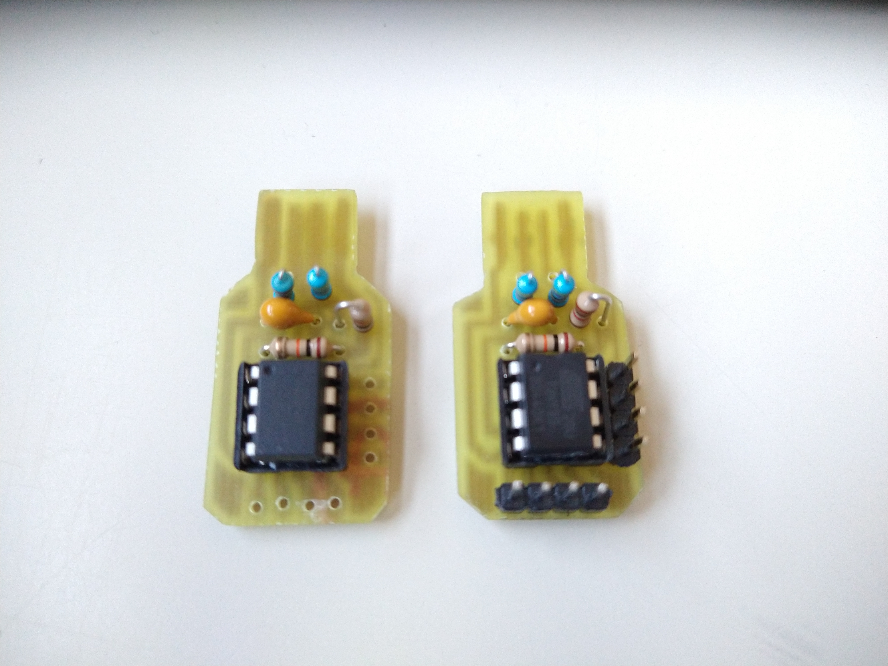

# TinyMight
My own version of a digispark (TinyMight)

## Project structure:
```
master/           
├─ images/          all the images for the project
├─ libraries/       a library with a compact library that contains all the projects
├─ examples/        all the examples
```


## Images


